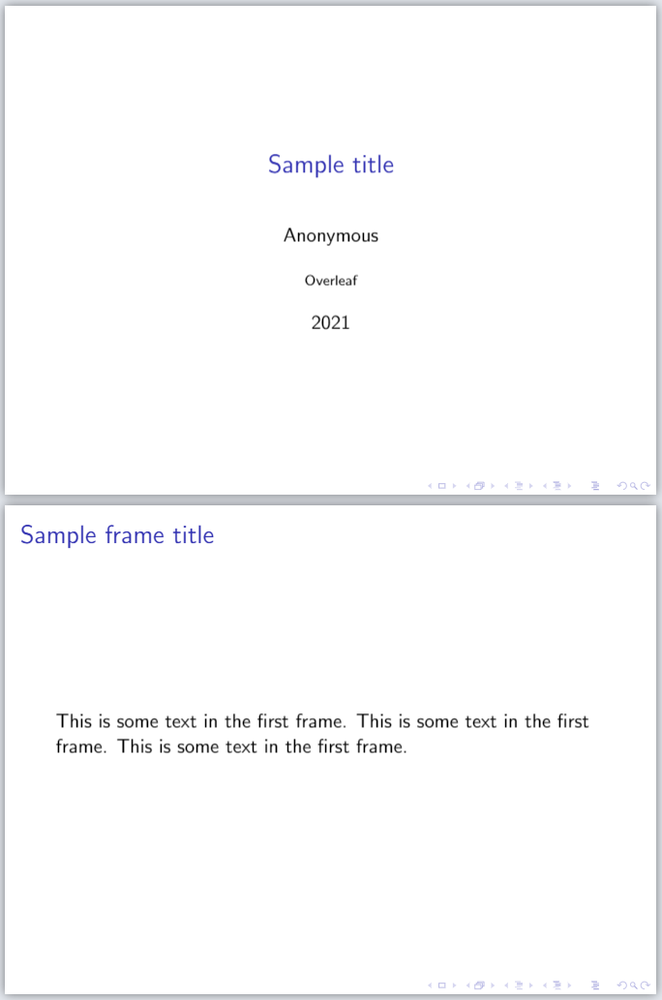
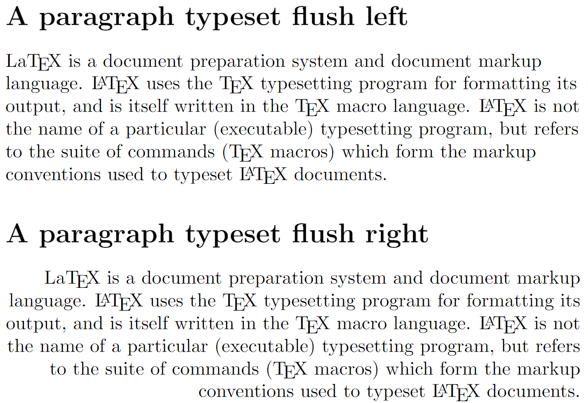
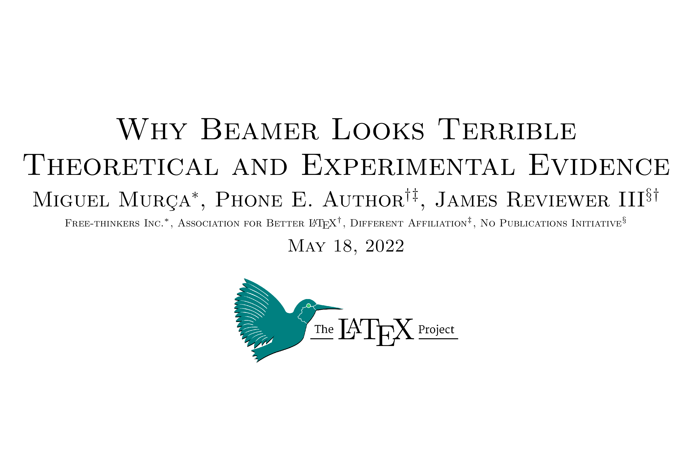

# beamleeeto

Your LaTeX presentations can look good. No, really.

## But Beamer!

Look at that:



Now look at that:



Now at this:



Now look at yourself, and think about what you've done.

## I have come to my senses, and recognize that Beamer is the inferior technology.

Good.

To use `beamleeto`, just

```latex
\documentclass{beamleeto}

\title{Presentation title}
\date{\today} % For example

\author{Author}
\affiliation{Affiliation} % Optionally
% Repeat as needed

\logo[height=1in]{logo.png} % Optionally

\begin{document}

\maketitle

\slide[Topics of the Presentation]
\maketopics

\slide[Title of the First Slide]
\subtitle[Preliminaries]
...

\end{document}
```


## Glue Space Scares Me

You can correct this in three simple steps:

1. Pick up [The TeX
   Book](https://www.amazon.com/TeXbook-Donald-Knuth/dp/0201134489)
2. Marvel at it, for the knowledge within outshines your space-glue-free
   intellect
3. Put it back down and go use PowerPoint

Alternatively, read [this TeXExchange
post](https://tex.stackexchange.com/a/64759), and stop being afraid of a little
`\vskip` and `\vfil`. Also stop using a technology by blindly copying and
pasting snippets of code.


## This Exchange is Unfair Because I don't get to Type my Responses

My repo, my rules. Nonetheless, feel free to send a passionate defence of
Beamer to `miguelmurca+beamleeto﹫gmail·com`, to be promptly archived.


## It's not on CTAN

Yes.


## Despite being thoroughly mistreated, I feel an incredible urge to send you money

[I can and will not stop you](https://www.paypal.me/miguelmurca/2.50).
